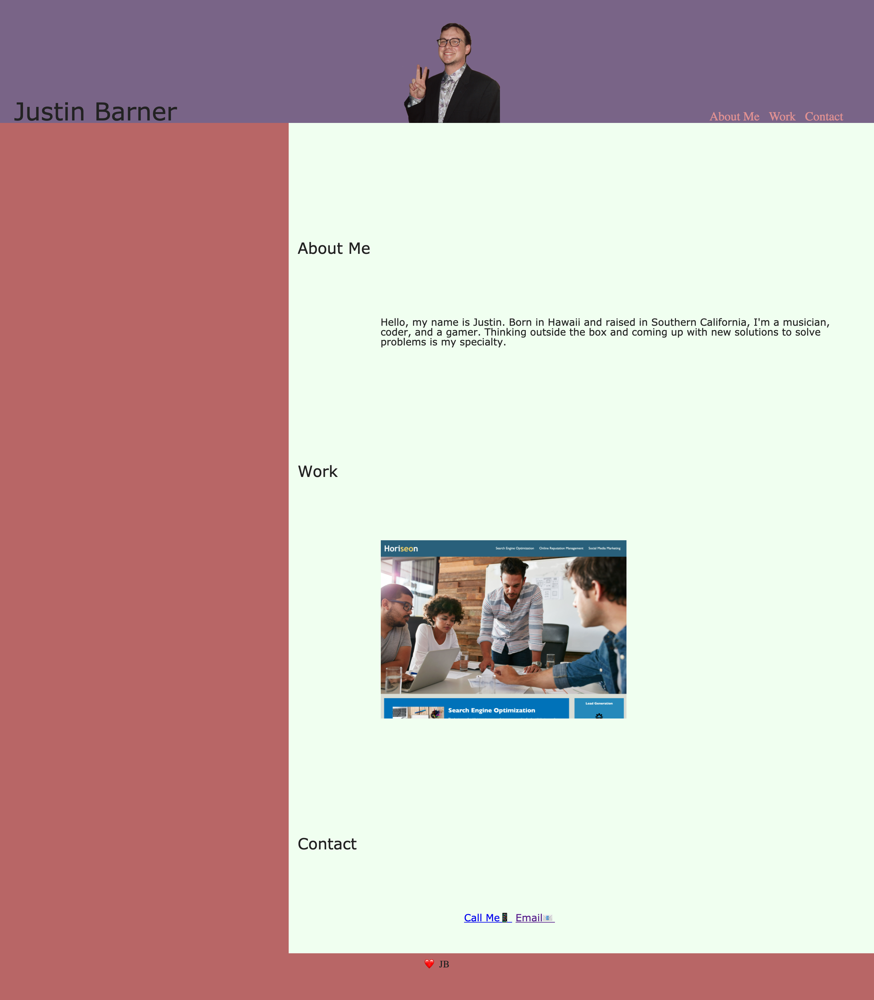
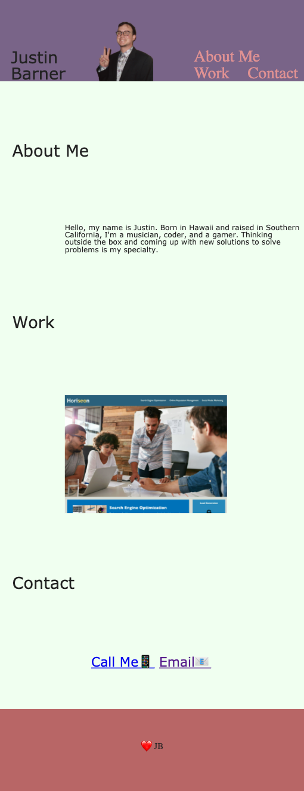
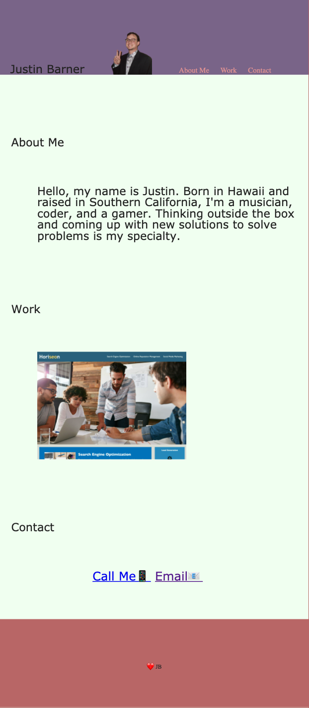
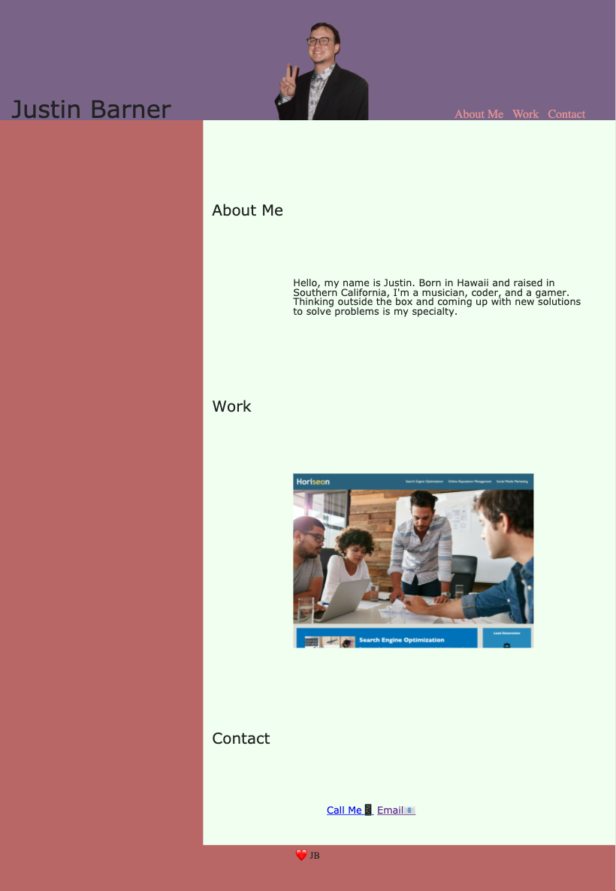

# Homer

## Description
---
    For this project I was required to build a website from scratch including an 'about me' as well as display my work and contact info. This website will be the layout of an online resume showing my applied skills in html, css and soon enough java script. To create the site I had to lean and understand more advance css like how to use media queries and flex grid to resize the layout of my page to scale to multiple screen sizes.

## Installation
---
 To install the application go to https://github.com/Jahbeezy/Homer , copy the ssh key and clone the repository using your terminal.
 Launch from index.html

## Usage
---
The page provides a flexable design and responsive scaling features.

https://jahbeezy.github.io/Homer/

## Credits
---
Collaborators:

Isreal Rios

Christian Castillo

Kelly Cano

Tyler Arthur

Alex Nunez

Resources:

https://www.w3schools.com/

https://developer.mozilla.org/en-US/

## Liscence
---

    MIT License

    Copyright (c) [year] [fullname]

    Permission is hereby granted, free of charge, to any person obtaining a copy
    of this software and associated documentation files (the "Software"), to deal
    in the Software without restriction, including without limitation the rights
    to use, copy, modify, merge, publish, distribute, sublicense, and/or sell
    copies of the Software, and to permit persons to whom the Software is
    furnished to do so, subject to the following conditions:

    The above copyright notice and this permission notice shall be included in all
    copies or substantial portions of the Software.

    THE SOFTWARE IS PROVIDED "AS IS", WITHOUT WARRANTY OF ANY KIND, EXPRESS OR
    IMPLIED, INCLUDING BUT NOT LIMITED TO THE WARRANTIES OF MERCHANTABILITY,
    FITNESS FOR A PARTICULAR PURPOSE AND NONINFRINGEMENT. IN NO EVENT SHALL THE
    AUTHORS OR COPYRIGHT HOLDERS BE LIABLE FOR ANY CLAIM, DAMAGES OR OTHER
    LIABILITY, WHETHER IN AN ACTION OF CONTRACT, TORT OR OTHERWISE, ARISING FROM,
    OUT OF OR IN CONNECTION WITH THE SOFTWARE OR THE USE OR OTHER DEALINGS IN THE
    SOFTWARE.